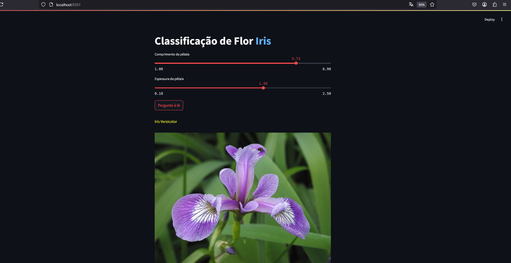

# iris-streamlit-deploy
a simple data app@streamlit for fast evaluation on ML models for classification - iris dataset
# installation - after cloning it to a project folder. Inside project folder
1) create an environment (do not use python 3.13.x, since tensorflow is not yet compatible). Use python 3.12.x
2) active it
3) pip install -r requirements.txt
4) run python iris_nn_tensorflow.py to save a new model
5) streamlit run app.py
This code was generated with keras 3.9.2, tensorflow 2.19.1 e python 3.12.8
</img>
